# Learning Git - Reflections

## Notes

(From [Beginner's Guide to GitHub](https://github.blog/developer-skills/github/beginners-guide-to-github-creating-a-pull-request/))

- **Pull request:** proposal to merge a set of changes from one branch into another
- **Source branch:** the one with your changes
- **Target branch:** where you're trying to move your stuff to

Writing comments into commits via command line:
`git commit -m "title" -m "description"`

## Pull Requests

### Why are PRs important in a team workflow?

Branches allow team members to work on multiple aspects of the project simultaneously. Pull requests allow them to merge their changes with another branch (including the main one) once they're complete.

Pull Requests do not automatically take effect. Instead, they first check for conflicts between files and alert team members if some are found. This allows team members to pick-and-choose which changes to keep and which to discard. This minimises the chance of accidentally saving over another person's work. (Changes can always be reverted, but it's still better to avoid that where possible.)

### What makes a well-structured PR?

Smaller pull requests are easier to review and merge. A lot of files being changed at once means a lot of potential bugs or conflicts. It also makes it somewhat more difficult to track or reverse the changes of a single function, if it's buried inside larger updates.

Titles of pull requests should be clear and to the point. Descriptions should include the purpose of the pull request, a summary of key changes, and links to extra context (issues, tickets, etc)

### What did you learn from reviewing an open-source PR?

The better PRs in the [linked open-source repo](https://github.com/facebook/react/pulls) provides explanations in roughly the same format:

- Title: Descriptive, stating what issue is being updated and how
- Summary: A quick description of the changes being made and their purpose, and/or a link to an issue or ticket
- Problem: The bug or issue the commit is designed to fix
- Fix/Solution/Scope: How the code has been altered to fix the problem
- Testing: How the commit was tested and the results of it

This is a big repo with a lot of contributors. While the comments may seem lengthy (especially for 'smaller' updates), keeping all the information together in one place ensures anyone can quickly review the context and assess if the code does what it's supposed to do.

Some of the titles here are inconsistently formatted. e.g. some start with '[devtools]' or '[compiler]' to specify what aspect of the project it targets, but most do not. Labels seem to be inconsistently applied as well, which may cause organisational issues in the long run.

A few titles are just 'Bug Fix' - very uninformative.

## Commit Messages

### What makes a good commit message?

- Starts with what type of change it is (e.g. add, remove, fix, test...)
- Is short, direct, and specific
- Avoids unnecessary punctuation, capitalisation, and filler words
- Uses imperative mood (written as if speaking a command)
- Follows team conventions. (I'm currently unsure of what style guide Focus Bear uses internally for git commits, if any. But in general if a project has an established outline for a commit message, I'll follow them.)

### How does a clear commit message help in team collaboration?

A good commit message quickly communicates to the team what the purpose of the commit is, without having to read the full description or examine the code. This is useful for both the team updated on what has been accomplished. It also gives code reviewers much-needed context, so they can double-check the commit does what the programmer thinks it does.

A good commit message also makes it easier to find a specific commit in the log. This is useful if a team needs to roll back an aspect of the project for any reason.

### How can poor commit messages cause issues later?

Basically the inverse of the above. If a comment is unclear, it becomes impossible to learn what has been added to the project without wasting time analysing the code. Code reviewers would have to speak directly to the team member who made the commit to learn what the code is *supposed* to be doing.

The more poorly-commented updates there are, the harder it becomes to find anything, and the longer it will take to roll things back.

## Git Bisect

### What does git bisect do?

Git Bisect performs a binary search on a repository's history to determine which commit a problem originated in. First, the user specifies the most recent "bad" commit, then specifies the last-known "good" commit.

Git Bisect then selects the middle point of the commit list, and pauses to allow users to run test scripts on each commit. If the bug is still present, it can be labelled via `git bisect bad`. If the bug is not present, `git bisect good` is used instead. The process continues in this fashion: git bisect continues to choose the mid-point between the most recent 'good' and 'bad', until it identifies where the 'bad' code started.

The commit with the error is therefore the last one to be labelled as bad.

### When would you use it in a real-world debugging situation?

Git Bisect is useful for pinpointing which commit introduced an error. Useful, if there are a lot of collaborators working on a single branch or project - no individual team member may understand how every single addition functions.

It can also be used to determine when an update was introduced. The method is identical, but the words "old" and "new" may be used in place of "bad" and "good" to prevent confusion. (Again, this changes nothing about the process.)

### How does it compare to manually reviewing commits?

Git Bisect allows the reviewer to select which range of commits they'd like to test, and automatically queues them up for revision and labelling. It can't check code by itself - therefore, it still requires the user to either run a test script or manually review the code before labelling. But automating the binary search process stops the task from getting overwhelming.

### Example Usage

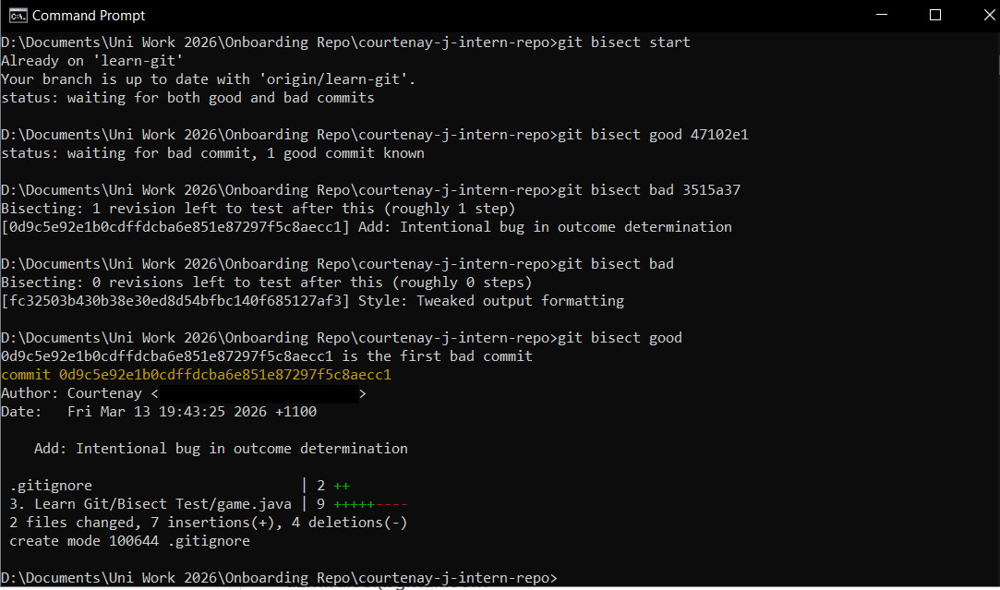

In this example, I committed five separate changes to the Bisect Test folder, with the third adding in a logical error and the fifth a missing semicolon.

In a proper development setting, I would run a test script after each bisect to automatically check the output of the program meets the intended result (e.g. rock beats scissors, scissors beats paper, paper beats rock). But for the purposes of this experiment, I stuck to static code analysis. Git Bisect prints the hash, contributor, and commit message of the commit currently being analysed, making it easy to track it down and identify where the problem is.

## Advanced Git Commands

### What does each command do?

- `git-checkout main -- <file>`: Copies a file from one branch into the workplace of the current branch.
  - More info: [here](https://git-scm.com/docs/git-checkout).
- `git cherry-pick <commit>`: Apply a commit from a different branch onto the current one, ignoring all other changes in that branch.
  - More info: [here](https://www.geeksforgeeks.org/git/git-cherry-pick/).
  - Note that this may cause conflicts (e.g. if a file does not already exist) - use Git Desktop to resolve it.
- `git log`: Shows the commit history of the current branch, as well as the hash for each commit. (Useful for Git Bash)
  - `git log --oneline`: restricts this history to one line per commit. (Still displays hashes!)
  - `git log -b <branchname>`: View log of a branch you're not currently on.
- `git blame <filename>`: Displays information on who last updated each line of the file, and when. (Funniest possible name for this command, by the way.) This includes:
  - The hash of the commit the line was last updated in
  - The name of the line's author
  - The timestamp of the update
  - The line's number
  - The contents of the line itself
  - Or, by modifying the command:
    - `git blame -e <file>` - shows the author's email instead of their name
    - `git blame -L start,end <file>` - pins the blame only within a certain range

### When would you use it in a real project (hint: these are all really important in long running projects with multiple developers)?

- `git checkout main -- <file>`: Useful if you only need a single file from one branch. Depending on the circumstances, this may be easier than rebasing the entire branch. Also useful for quick typo fixes, or to restore a file you broke in your own branch.
- `git cherry-pick`: Useful for placing a quick hotfix from one branch into another. Can also be used to quickly undo parts of a commit, useful if work was accidentally saved over. (Caution: can cause duplicate commits if used incorrectly, which would clutter up repo history.)
- `git log --oneline`: useful for quickly summarising recent commits, or grabbing hashes in preparation for `git bisect`
- `git blame`: quickly determine who contributed what to the current state of a file, and when. Good for when you need to contact the author(s) about the purpose of a change.

### What surprised you while testing these commands?

i was surprised by how flexible command parameters are. Being able to get information from another branch via `-b <branchname>` makes grabbing hashes or blame much faster than navigating the git webpage.

I was loosely familiar with cherry-pick from my first year at Swinburne. I am surprised at how easy it is now that I understand what's actually happening.

## Testing Notes

All commands were tested via Git CMD. (GitHub for Windows no longer includes a CLI.)

- `git cherry-pick`: Tested with commit [hash 97b3551aeab12e652414e3a46bb4e2054dca61e1](https://github.com/Courtenay-J/courtenay-j-intern-repo/commit/97b3551aeab12e652414e3a46bb4e2054dca61e1).
- `git checkout main --cherrypick_test.md`: [hash 1876637e4acb91da256042d62890c8896b26f720](https://github.com/Courtenay-J/courtenay-j-intern-repo/commit/1876637e4acb91da256042d62890c8896b26f720).
- `git log --oneline`: Screenshot below.

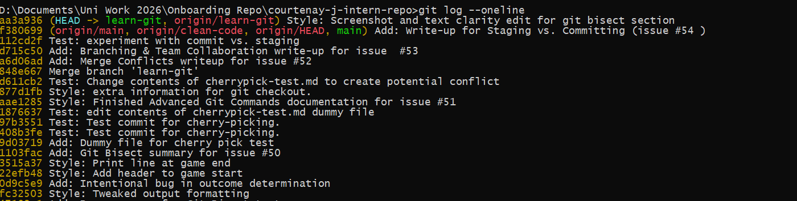

- `git blame`: Screenshot below.

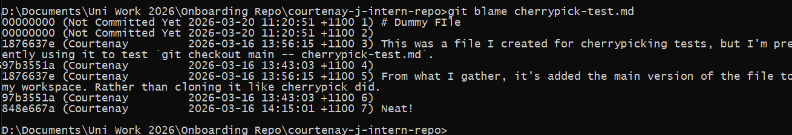

## Merge Conflicts & Conflicts Resolution

### What caused the conflict?

The contents of cherrypick-test.md were different in the `main` and `learn-git` branches. Git could not import the new file without potentially overriding the old one.

(Yes, again. I used the same dummy file just to be safe.)

### How did you resolve it?

I opened the file in Visual Studio Code, which allowed me to choose which lines I wanted to keep vs. which I wanted to replace with a new version. Ultimately I decided to replace the whole file, but it was interesting to see that I could pick and choose which lines I wanted.

### What did you learn?

Not much - I had prior experience resolving conflicts from previous group projects. Regardless, it gave me the chance to see how VSC's interface handles it, and practice going line-by-line. (GitHub Desktop is not that granular, and would only permit you to pick one of the two files to keep.)

### Test Notes

- Relevant commits: [One](https://github.com/Courtenay-J/courtenay-j-intern-repo/commit/054af0851e777adeb08bbcdac5f901d3397cc35d), [two](https://github.com/Courtenay-J/courtenay-j-intern-repo/commit/03d5a771e5b461595f82881c37e695ba5d24b4c3), [merge](https://github.com/Courtenay-J/courtenay-j-intern-repo/commit/0b5f9b198419491c0fc9edecae2694700716db79).
- Screenshots of using GitHub Desktop and VS Code to resolve conflicts:

**Warning in GitHub Desktop**

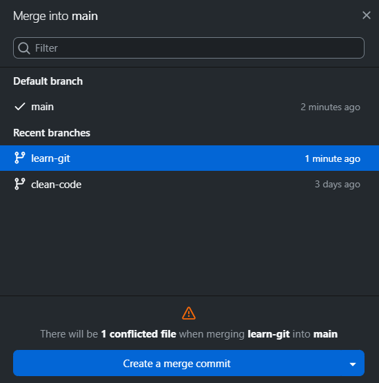

**List of Conflicting Files**

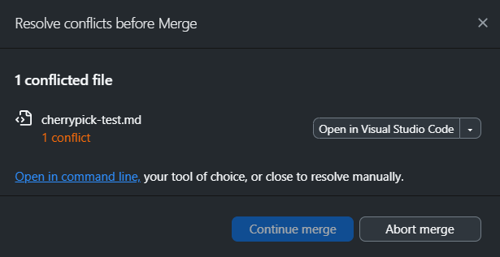

**VS Code allowing a choice between conflicting lines**

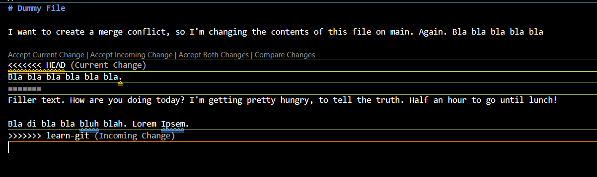

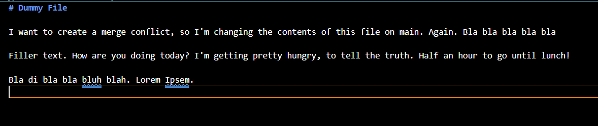

**Conflict resolved**

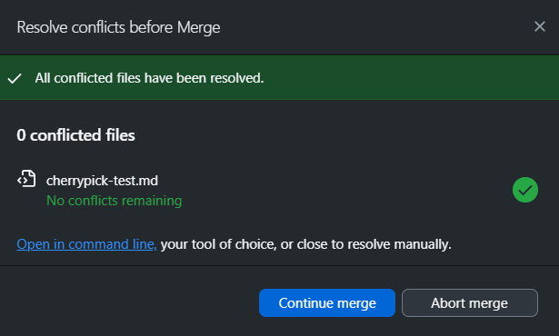

## Branching & Team Collaboration

### Why is pushing directly to main problematic?

Pushing changes to main is problematic for a number of reasons, particularly when working in large teams:

- If every update is pushed into main, the commit history becomes cluttered. Code reviewers will have to sort through unrelated commits to find ones relevant to the feature they're working on.
- It's the branch all other branches ultimately stem from, so an error on main (be it due to an oversight or an unfinished feature) would affect all new branches beyond that point. 
- In general, branches provide a safe testing ground for developing new features. If something goes wrong, a branch can be rolled back or discarded without impacting the rest of the project. If everything was pushed to main, then separating the bad commits from the good ones gets much more complicated.

### How do branches help with reviewing code?

Assuming one branch focuses on the development of one update (a feature, a bug fix, etc.), branches keep the commit log focused on that topic. The code reviewer will not need to sort through every commit in the project - just the commit history of the branch.

Since branches and their history are isolated, this allows reviewers to perform `git bisect` searches more easily. A branch being isolated means test scripts are more likely to pick up on bugs related to the changes being analysed.

Finally, if all else fails: if is horribly broken in one branch and not another, the reviewer can manually compare the code of those two versions to identify the cause.

### What happens if two people edit the same file on different branches?

Initially, nothing. They are actually working on two isolated *copies* of the same file.

It's only when a user tries to merge those branches into the same branch that a conflict occurs. When this happens, git will prompt the person performing the second commit to choose which parts to keep. See "Merge Conflicts & Conflicts Resolution" above.

## Staging vs. Committing

### What is the difference between staging and committing?

- `git add <filename>`: Staging changes *prepares* them for a future commit. Any staged file will be included in the next commit, whereas any unstaged files will be excluded from it (even if they've been modified).
- `git commit -m "Commit message"`: Committing changes *adds* the currently staged changes to the repository.

### Why does Git separate these two steps?

Git separates these steps so you can have control over exactly what you upload, rather than always adding every change you've made.

### When would you want to stage changes without committing?

Git staging is helpful if you've modified multiple files, but only want to include a couple in the current commit. For example, if you've completed multiple tasks, separating the files into multiple commits results in a clearer history log and easier code revision. One commit should reflect one task. So, you can stage the files for task 1, commit it, then stage the files for task 2, and commit that.

It's also useful if you want to avoid uploading unfinished files.

### Test notes

- Staging tested via [commit 112cd2fdb239d6945d0001bacd5b01851f243ddf](https://github.com/Courtenay-J/courtenay-j-intern-repo/commit/112cd2fdb239d6945d0001bacd5b01851f243ddf). (Obviously, only the staged files were added to this commit. The unstaged files remained on my computer.)
- Staging is possible in both Git CMD and GitHub Desktop. The latter is easier, as checking/unchecking boxes in the interface stages/unstages those files. In these screenshots, the items with checkmarks on the left are staged and the others are unstaged. Green items are new files, while yellow items are modified files.

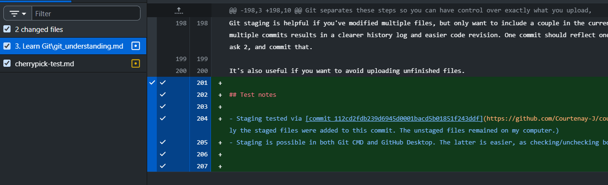
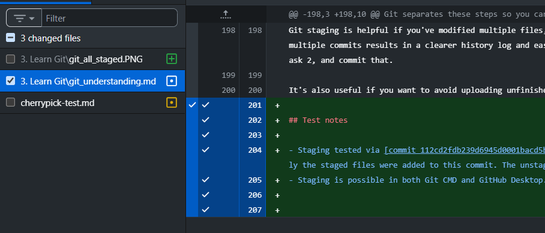

- Or, if using the CMD:

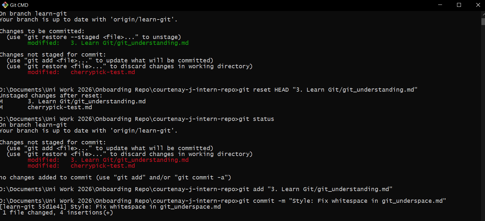